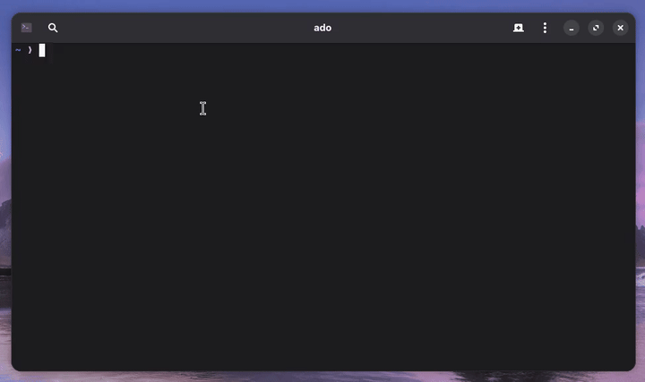

<h3 align="center">addsong</h3>

<p align="center">
  
</p>

<p align="center"><b>Paste a link, and the song shows up in Apple Music automatically.</b></p>

`addsong` a song name or a YouTube link. It downloads the track, adds the
**title, artist, and cover art**, and drops it into Apple Music. No dragging
files around making downloading unofficial music seamless.

```bash
addsong "songname"                      
addsong "https://www.youtube.com/watch?v=..." 
```

## Installation

### macOS&nbsp; 

```bash
brew install ado11231/tap/addsong
```

### Linux&nbsp; 

```bash
curl -fsSL https://raw.githubusercontent.com/ado11231/apple-music-pipeline/main/install.sh | bash
```

### Windows&nbsp; 

Paste into **PowerShell**, then run `addsong` from **Git Bash** or **WSL**
afterwards, not from PowerShell:

```powershell
irm https://raw.githubusercontent.com/ado11231/apple-music-pipeline/main/install.ps1 | iex
```

Check version to see if installation worked.

```bash
addsong --version
```

## Your First Song

```bash
addsong "songname"
```

`addsong` shows what it found so you can fix mistakes before it saves:

```
  Review track ♪
  Artist: Artist Name
  Title:  Song Title

  [Enter] Add  ·  [E] Edit  ·  [S] Skip
  ❯
```

Press **Enter** and the song lands in Apple Music a second later.

## Commands


| Command                        | What it does                                    |
| ------------------------------ | ----------------------------------------------- |
| `addsong "name"`               | Add the top search result                       |
| `addsong "<link>"`             | Add a specific video                            |
| `addsong --results 3 "name"`   | Add the top 3 search results                    |
| `addsong --playlist "<link>"`  | Add a whole playlist                            |
| `addsong --from list.txt`      | Add every link in a file                        |
| `addsong subscribe "<link>"`   | Follow a playlist                               |
| `addsong sync`                 | Add new songs from playlists you follow         |
| `addsong list`                 | Show playlists you follow                       |
| `addsong unsubscribe "<link>"` | Stop following a playlist                       |
| `addsong forget`               | Forget everything added (so it can be re-added) |


## Flags


| Flag                    | What it does                                           |
| ----------------------- | ------------------------------------------------------ |
| `-y`                    | Don't ask, just add it                                 |
| `--review`              | Always pause to fix the title/artist first             |
| `--reimport`            | Add a song again even if you already have it           |
| `--dry-run`             | Show what would happen, without downloading            |
| `--format FMT`          | Output format: `m4a` (default), `mp3`, `flac`, `opus`… |
| `--quality N`           | Audio quality `0`-`10` (`0` = best, the default)       |
| `--notify`              | Pop a desktop notification as each song imports        |
| `--quiet` / `--verbose` | Show less / more output                                |
| `--help`                | Full list of commands and options                      |


Set environment variables like `ADDSONG_WATCH_DIR` for permenant defaults.

run `addsong --help` for the full list.

## Download Location

On macOS and Windows they go straight into Apple Music; on Linux they land in
`~/Music/addsong/`. Point them elsewhere with `ADDSONG_WATCH_DIR=/your/folder`.

## Common Errors

- `command not found` — reopen your terminal; if it persists, re-run [Install](#install).
- **Nothing shows up** — open the Apple Music app and keep it open while adding (macOS/Windows).
- **A download failed** — update `yt-dlp`, then retry with `--verbose` to see why.

